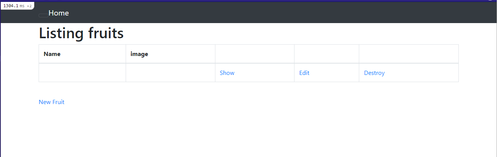
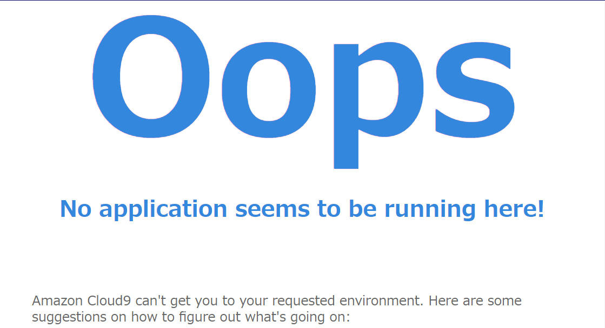

## 報告

アプリケーションの起動
実行：bin/cloud9_dev  
実行後アプリケーション [URL](https://8002d3738f19443dabb9c0ec18bf66c6.vfs.cloud9.ap-northeast-1.amazonaws.com)


### APサーバー

Puma version: 5.6.5  
Webサーバーの一種でRailsを動かすためのアプリケーションサーバとしても動作する

```
$ rails s
=> Booting Puma
=> Rails 7.0.4 application starting in development 
=> Run `bin/rails server --help` for more startup options
Puma starting in single mode...
* Puma version: 5.6.5 (ruby 3.1.2-p20) ("Birdie's Version")
以下略
```

```
# 稼働プロセスを確認
$ ps aux | grep puma
ec2-user 15260  5.4 12.1 980672 118616 pts/1   Sl+  09:54   0:01 puma 5.6.5 (tcp://localhost:8080) [raisetech-live8-sample
ec2-user 15552  0.0  0.0 119428   952 pts/4    S+   09:55   0:00 grep --color=auto puma
# サーバー停止 番号はアプリケーション稼働時にも確認できる
$ kill -9 15260
# 再開
rails s
```

サーバー停止時アプリケーション画面


### DBサーバー

Mysqlログイン後status確認より
使用バージョン
mysql  Ver 8.0.35 for Linux on x86_64 (MySQL Community Server - GPL)
https://26gram.com/start-stop-mysql　参考

```
# Mysqlログイン(-pはパスあり)
mysql -u root -p
# Mysqlの起動
sudo service mysqld start
# Mysqlの停止
$ sudo service mysqld stop
# MySQLの再起動
$ sudo service mysqld restart
# Mysqlの状態確認
$ sudo service mysqld status
```
サーバー停止時のアプリケーション画面


### 構成管理ツール

Bundler version 2.3.14  
Gemの依存関係とバージョン管理するためのツール
$ bundle list　でインストールしてあるgemパッケージの確認が可能
Gemfileにバージョンを指定して記載していく  
Gemfile.lock というファイルは依存関係を解決した結果をBundllerが自動で書き換えていく

## 感想

- 作業工程を講座で実行する流れで分からない部分を調べながら行っていたらだいぶかかってしまったが、その分理解は進んだと思う。  
database.ymlなど、最初に自力で調べながら挑戦したときにはわからずにいた部分も改めて手順通り行った際に調べてどの時点で生成されるものなのか等理解度をあげられてよかった。  
アプリケーション起動後、APサーバーについて調べるなかで「ps aux | grep puma」のようなコマンドの記述方法も発見だった。アプリケーション起動中に別の窓で操作を行うのも、はじめはこれで大丈夫なのか、起動中のアプリケーションへの影響はどうなのか、など起動までの構成とは違い少し緊張した。  

- Nodoやyarnがうまくインストールされてない？
Cloud9のインスタンスを再起動するとNodo,yarn,npmあたりが認識していない状態になっていた（ターミナルで-vのバージョン確認で失敗する）
$nvm use 17.9.1  
の実行でインストールしているものがまとめて認識している状態になる
都度実行するのが手間→nvmの環境パスを通すこと、デフォルト設定を行うことで起動時に作動するように  
[参考１](https://photo-tea.com/p/17/hexo-start-kit-tools-4/):環境パス  
[参考２](https://east-cloud.net/nvm/):デフォルト設定  
